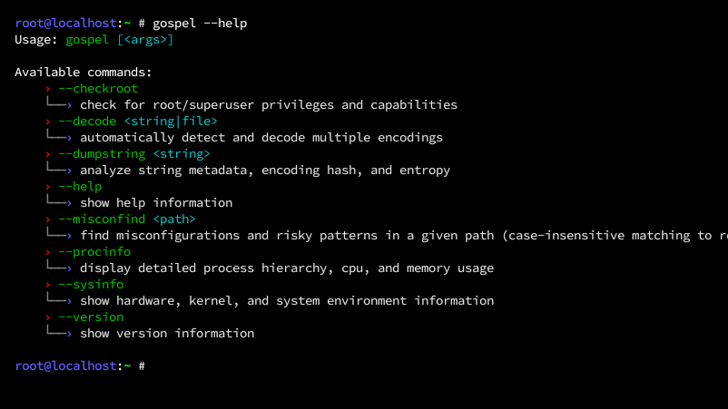
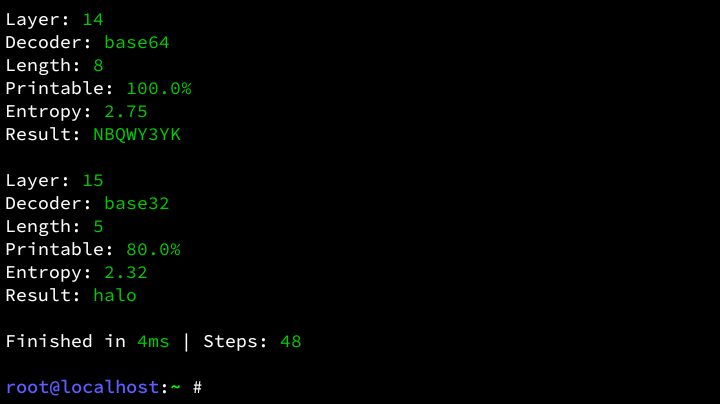
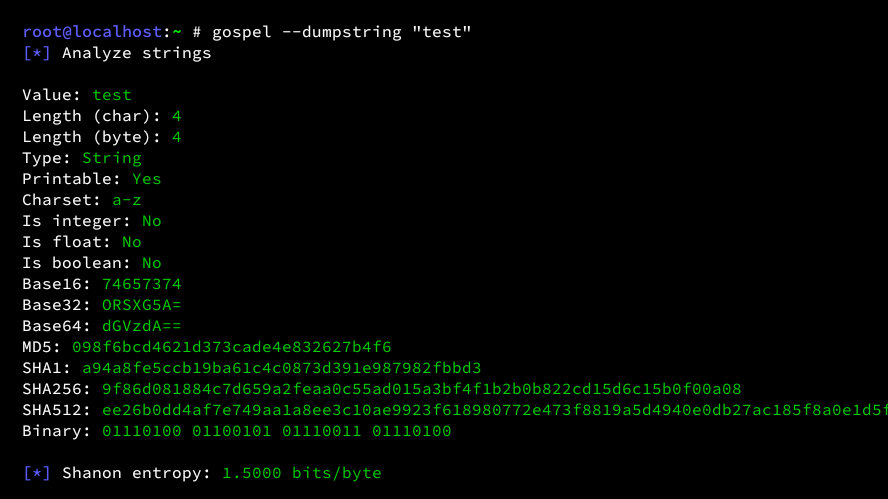

<!-- Gospel Project -->

[]()
[]()
[]()
[](LICENSE)

# Gospel
Gospel is an all-in-one CLI toolkit for system exploration, security auditing, and data inspection. <br>
From decoding obscure strings to uncovering system misconfigurations, Gospel gives you deeper insight into your system.

## Preview
<details>
<summary>Show Preview</summary>
<br>

<br><br>

<br><br>

<br>
</details>

## Features
- Inspect system and hardware information
- Analyze running processes and resource usage
- Detect misconfigurations and potential risks
- Decode and analyze encoded data automatically
- Extract insights from strings (entropy, hashes, metadata)
- And more

## Testing
<table>
	<tr>
		<th>OS</th>
		<th>Version</th>
	</tr>
	<tr>
		<td>Debian</td>
		<td>Trixie</td>
	</tr>
    <tr>
        <td>Ubuntu</td>
        <td>25.10</td>
    </tr>
	<tr>
		<td>Kali</td>
		<td>Rolling</td>
	</tr>
    <tr>
        <td>Alpine</td>
        <td>3.23</td>
    </tr>
	<tr>
		<td>Termux</td>
		<td>0.118.3</td>
	</tr>
</table>

## Installation
```bash
git clone https://github.com/Zeronetsec/Gospel.git
cd Gospel
chmod +x install.sh
./install.sh
```

## Usage
```bash
gospel --misconfind <path>
gospel --procinfo
gospel --sysinfo
gospel --decode <string|file>
gospel --help
gospel --version
```
And more commands.

## License
This project is licensed under the MIT License. <br>

<!-- Copyright (c) 2026 Zeronetsec -->